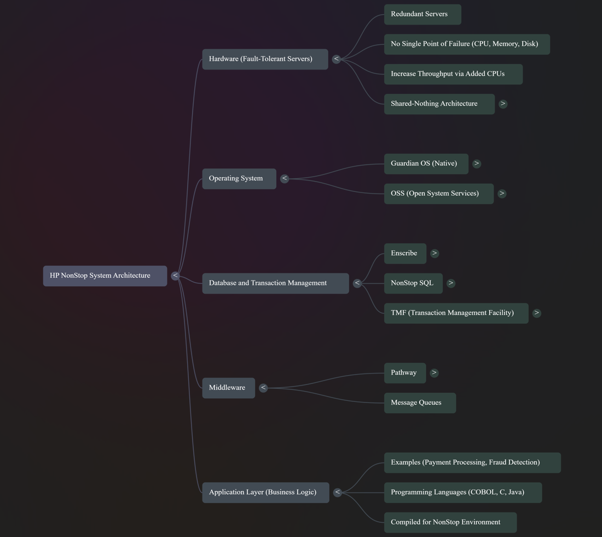

1. Architecture Layers

Think of HP NonStop as a layered cake. Each layer builds on the one below.
a. Hardware (Fault-Tolerant Servers)
Specially designed servers that are redundant.
No single point of failure: every CPU, memory, and disk can fail and the system still runs.
You can add more CPUs to increase throughput.
Called shared-nothing architecture → each CPU owns its memory & disk.

b. Operating System (Guardian OS / OSS)
Guardian OS is NonStop’s native OS → manages fault tolerance and checkpointing automatically.
OSS (Open System Services) provides Unix-like features so apps written for Unix/Linux can run here.

c. Database (Enscribe / NonStop SQL)
Enscribe → file-based DB, very fast for key-value or sequential access.
NonStop SQL → relational database built for parallelism and fault-tolerance.
Transaction Manager (TMF – Transaction Management Facility)
Guarantees ACID properties: Atomicity, Consistency, Isolation, Durability.
If power fails mid-transaction, TMF ensures either the transaction fully commits or rolls back — no partial updates.

d. Middleware (Pathway, Message Queues)
Pathway manages client/server message routing → distributes requests across multiple server processes.
Ensures workload balancing, queuing, and fault tolerance at the application layer.

e. Application Layer (COBOL/C Banking Apps)
Business logic (e.g., payment processing, fraud detection).
Written in COBOL, C, or Java but compiled to run in NonStop’s environment.

2. Why HP NonStop?

Fault Tolerance → No single point of failure. If one CPU dies, others continue.
High Availability (99.999%) → Known as “five nines.” That means the system is down for ~5 minutes per year, max.
Linear Scalability → Add more CPUs = handle more transactions.
Ex: 3,000 TPS normal → add CPUs → handle 6,000 TPS at Christmas.
Shared Nothing → Each CPU has its own memory/disk. If one fails, others unaffected.

3. Process Pairs & Checkpointing

This is HP NonStop’s secret sauce.
Primary Process (Active) → Actually handles your transaction.
Backup Process (Passive) → Runs in parallel, always in sync.

Checkpointing:
The primary process constantly shares its “state” with the backup.
Ex: If you are writing a file, the checkpoint includes which line you last wrote.
If the primary dies, the backup takes over from the last checkpoint — not from scratch.

Failover Sequence:
Detection – system detects primary failed (in milliseconds).
Promotion – backup is promoted to primary.
Recovery – a new backup process is spawned elsewhere.
Effect: No user ever sees a failed transaction. The work just continues.